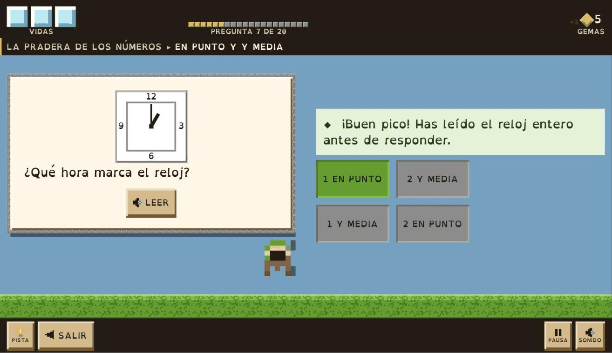
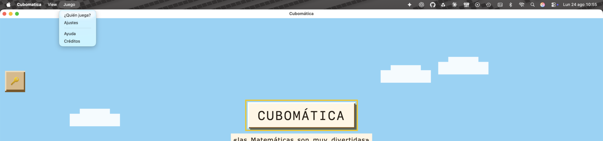

<div align="center">
  
  <h1>Cubomática</h1>
  <p><b>El juego de matemáticas de Educación Primaria,<br>como aplicación de escritorio para macOS.</b></p>
  <p>
    <a href="#versionado"></a>
    <a href=".python-version"></a>
    <a href="pyproject.toml"></a>
    <a href="https://docs.astral.sh/uv/"></a>
    <a href="#requisitos"></a>
    <a href="#tests"></a>
  </p>
  <br>
  
</div>

---

## Tabla de contenidos

- [Qué es esto](#qué-es-esto)
- [Requisitos](#requisitos)
- [Puesta en marcha](#puesta-en-marcha)
- [Uso diario](#uso-diario)
- [Tests](#tests)
- [Empaquetado](#empaquetado)
- [Estructura del proyecto](#estructura-del-proyecto)
- [Decisiones técnicas](#decisiones-técnicas)
- [El puente JavaScript ↔ Python](#el-puente-javascript--python)
- [Limitaciones conocidas](#limitaciones-conocidas)
- [Versionado](#versionado)
- [Licencia](#licencia)
- [Registro de cambios](CHANGELOG.md)

---

## Qué es esto

Una ventana nativa de macOS que carga el juego **Cubomática** (HTML, CSS y JavaScript sin
frameworks) mediante [pywebview](https://pywebview.flowrl.com/), empaquetada con PyInstaller
como `Cubomatica.app`. **La apariencia es idéntica a la del navegador.**

Ya no es una web ni una PWA. Se abre como cualquier aplicación del Mac, funciona sin conexión
y **no abre ningún puerto** en el equipo.

> [!NOTE]
> `index.html` carga directamente `css/cubomatica.css` y `js/cubomatica.js`: **lo que se lee es
> lo que corre.** Hasta 4.5.0 cargaba unos gemelos `.min` que había que mantener a mano; bajo
> `file://` la minificación no ahorra nada perceptible, así que se retiraron y un test avisa si
> vuelven.
>
> `index.html` se mantiene formateado con `herramientas/formatear-html.py`, y otro test avisa si
> vuelve a una sola línea.

---

## Requisitos

| | |
|---|---|
| **Sistema** | macOS 11 o superior |
| **Motor web** | WebKit — ya viene con el sistema, no hay que instalar nada |
| **Python** | 3.11, que instala `uv` automáticamente |
| **uv** | 0.12.0 o superior |

<details>
<summary>Otros sistemas operativos</summary>

El código es portable, pero el empaquetado de este repositorio es solo de macOS.

| Sistema | Motor web | Hay que instalar |
|---|---|---|
| Windows | WebView2 (Edge) | Normalmente ya viene en Windows 10 y 11 |
| Linux | GTK + WebKit2 | `sudo apt install python3-gi gir1.2-webkit2-4.1` |

</details>

---

## Puesta en marcha

**1. Instalar `uv`** (una sola vez):

```bash
curl -LsSf https://astral.sh/uv/install.sh | sh
uv --version          # debe ser 0.12.0 o superior
```

Si tu versión es más antigua, `uv` avisa y no continúa. Actualiza con `uv self update`.

**2. Instalar el proyecto**, desde su carpeta:

```bash
uv sync
```

Eso hace tres cosas: crea el entorno virtual en `.venv/`, instala las librerías declaradas en
`pyproject.toml` y genera `uv.lock` con las versiones exactas. **No hace falta activar el
entorno**: `uv` se encarga.

**3. Arrancar el juego:**

```bash
uv run cubomatica
```

---

## Uso diario

| Qué quiero | Comando |
|---|---|
| Arrancar la app | `uv run cubomatica` |
| Arrancar con DevTools y trazas | `CUBOMATICA_DEBUG=1 uv run cubomatica` |
| Pasar los tests | `uv run pytest` |
| Pasar un solo test | `uv run pytest tests/test_api.py -v` |
| Revisar el estilo | `uv run ruff check .` |
| Construir la app | `./build-mac.sh` |
| Regenerar el icono | `./make-icon.sh` |
| Dejar `index.html` legible | `python3 herramientas/formatear-html.py src/cubomatica/web/index.html` |
| Añadir una librería | `uv add <librería>` |
| Añadir una de desarrollo | `uv add --dev <librería>` |
| Ver las instaladas | `uv pip list` |
| Instalar exactamente lo del lock | `uv sync --frozen` |

---

## Tests

```bash
uv run pytest                                              # los 81
uv run pytest --cov=cubomatica --cov-report=term-missing   # con cobertura
```

No comprueban solo la lógica de Python: casi todos protegen alguna decisión que, si se
revierte, rompe la app **en silencio**.

| Comprobación | Qué evita |
|---|---|
| El puente expone exactamente tres métodos | Que algo llegue a JavaScript por descuido |
| Los métodos `_privados` no se exponen a JavaScript | Filtrar API interna al navegador |
| La ventana viaja en un atributo privado | Romper el puente entero con un objeto que no es JSON |
| Existen `index.html`, CSS, JS, imágenes y audio | Empaquetar una app incompleta |
| Todas las rutas del HTML son relativas | Que el `.app` abra una ventana en blanco |
| `main.py` carga con `file://` | El `404 Not Found` por choque de puertos |
| `main.py` usa `private_mode=False` | Perder los perfiles y el progreso al cerrar |
| `index.html` sigue formateado | Que vuelva a una sola línea y deje de poder revisarse |
| La fuente viaja dentro del paquete | Que el juego se caiga a Verdana sin avisar |
| La pantalla completa se comprueba, no se pide | Que arranque en ventana una vez de cada tres |
| `pyproject.toml` y el `.spec` declaran la misma versión | Que la app diga una versión y el paquete otra |
| Todas las librerías están fijadas con `==` | Que una actualización silenciosa rompa la app |
| El aviso de licencia viaja dentro de `web/` | Distribuir el juego sin decir de quién es |
| La reserva de derechos deja fuera fuente y música | Reclamar derechos sobre obra ajena |
| No queda ni un emoji en `index.html` | Que un icono vuelva a pintarse con la fuente del sistema |
| Ajustes expone alto contraste y animaciones | Esconder dos requisitos de accesibilidad en el panel del adulto |
| Elegir curso tiene su propio titular | Que la decisión que manda en todo el contenido vuelva a ser letra pequeña |
| La portada dice quién juega y en qué curso | Que colarse de curso al crear el perfil siga siendo invisible |
| Las esquinas de la portada conservan su `absolute` | Que la llave del panel adulto vuelva a la esquina contraria |
| La ficha del minero pinta su sprite | Volver al cuadrado de color con `CB.sprites.avatar` sin llamar |
| Ayuda, Mis vetas, el álbum y los perfiles se ensanchan | Leer una tira de 640 px con media pantalla vacía al lado |
| Quitar un minero va detrás de un modo, no de un aspa | Que un toque de más se lleve por delante el progreso de otro |
| La expedición a medias se puede dejar | Quedarse con «Seguir jugando» hasta que caduque a las 24 h |
| Se puede seleccionar texto en el panel adulto | Que pywebview vuelva a apagar la selección en toda la página |
| Guardar e imprimir pasan por el puente antes que por el blob | Que la ventana se vaya del juego y no haya forma de volver |
| Los dos sitios que conectan «Imprimir» lo hacen igual | Arreglar el informe y dejar muda la ficha de refuerzo |
| Restaurar una copia no depende de un gesto humano | Un botón que funciona por suerte |
| Sin ningún minero todavía se puede restaurar | Perder la copia de seguridad justo el día que hace falta |
| El paquete declara el español | Que macOS pinte «Save file» y «Cancel» en un juego en español |
| La franja de la partida dice el curso | Jugar sin saber de qué curso es la veta que se está cavando |
| No hay dos elementos con el mismo `id` | Un botón mudo y otro con dos manejadores, sin un solo error en consola |

---

## Empaquetado

```bash
./build-mac.sh        # -> dist/Cubomatica.app
```

El script limpia, sincroniza dependencias, compila con PyInstaller y **firma la app en local**.
Esa firma *ad hoc* no es opcional en Apple Silicon: sin ella macOS cierra la app al abrirla.

El resultado pesa unos 69 MB, de los cuales unos 42 MB son las nueve pistas de música.

📄 El paso a paso completo, el icono y los problemas típicos están en **[EMPAQUETAR-MAC.md](EMPAQUETAR-MAC.md)**.

---

## Estructura del proyecto

```
cubomatica/
├── pyproject.toml           # librerías, versión y comando de arranque
├── uv.lock                  # versiones exactas (lo genera uv)
├── .python-version          # Python fijado en 3.11
├── Cubomatica.spec          # configuración del .app
├── build-mac.sh             # construye dist/Cubomatica.app
├── make-icon.sh             # regenera assets/icon.icns desde el SVG
├── .github/workflows/
│   └── ci.yml               # tests, lint, HTML y build del .app en cada push
├── herramientas/
│   └── formatear-html.py    # deja index.html legible sin cambiar lo que se pinta
├── assets/
│   ├── icon.svg             # el dibujo del icono (el mismo que el favicon)
│   └── icon.icns            # icono del .app
├── CHANGELOG.md             # novedades de cada versión
├── LICENSE                  # copyright del repositorio entero
├── docs/                    # imágenes de este README y las propuestas de mejora
├── tests/
│   ├── conftest.py          # fixtures compartidas
│   ├── test_api.py          # contrato del puente JS ↔ Python
│   └── test_web.py          # ficheros, rutas, persistencia y versión
└── src/
    └── cubomatica/
        ├── main.py          # abre la ventana y monta el menú
        ├── api.py           # puente JavaScript ↔ Python
        └── web/             # EL JUEGO
            ├── index.html
            ├── LICENCIA.txt # el aviso que viaja dentro del .app
            ├── css/  js/    # una hoja y un bundle, legibles, sin gemelos .min
            ├── fonts/       # OpenDyslexic + su licencia
            ├── img/
            └── audio/       # música, ~42 MB
```

---

## Decisiones técnicas

Seis decisiones sostienen la app. Ninguna es cosmética: revertir cualquiera de ellas la
rompe, y en cuatro casos **sin dar ningún error**.

### La ventana arranca a pantalla completa

El juego está pensado para apaisado, así que arranca a pantalla completa de verdad —lo mismo que
el botón verde—, y nadie tiene que colocar nada antes de jugar. `width` y `height` (1280 × 800)
no son el tamaño de arranque, sino el que tendrá la ventana al salir de ella. El mínimo es
1024 × 640.

Lo hace `pantalla_completa()`, no pywebview. `fullscreen=True` en `create_window` manda la orden
antes de que la ventana esté en pantalla y macOS la descarta en silencio: entra dos de cada tres
veces. Como el fallo es intermitente, un arranque bueno no demuestra nada. Así que la función no
lo pide y se fía, sino que **comprueba** el `styleMask` de la ventana nativa y reintenta hasta
que diga que sí.

### El juego se carga con `file://`

`main.py` abre la ventana con `url=index.as_uri()`.

Si se le pasa la ruta suelta, pywebview la considera «local» y **levanta un servidor HTTP
interno**. Con `private_mode=False` ese servidor usa siempre el **puerto fijo 42001**, así que
basta con que quede otra instancia viva para que la siguiente no pueda abrirlo y la ventana
muestre `Error: 404 Not Found` en lugar del juego.

Con `file://` no hay servidor, no hay puerto y no queda ningún socket a la escucha. La ruta se
resuelve además con `.resolve()`: dentro del `.app` la web cuelga de un enlace simbólico
(`Contents/Frameworks` → `Contents/Resources`) y WKWebView lo carga como una ventana en blanco
si no se resuelve.

### El progreso persiste gracias a `private_mode=False`

El juego guarda perfiles, progreso y ajustes en `localStorage`. Lo único que hace que sobrevivan
al cierre es arrancar con `private_mode=False`: en modo privado, el backend Cocoa usa un almacén
no persistente y se pierde todo.

> [!WARNING]
> **`storage_path` no tiene efecto en macOS.** pywebview lo ignora y usa siempre
> `WKWebsiteDataStore.defaultDataStore()`, es decir `~/Library/WebKit/<identificador>/WebsiteData/`.
> Se mantiene en el código porque Windows y Linux sí lo respetan.

Como consecuencia, el `.app` (`es.javiertamarit.cubomatica`) y el modo desarrollo
(`org.python.python`) **no comparten progreso**. Es lo deseable: probar no ensucia la partida real.

### La tipografía viaja dentro del paquete

El juego se lee en **OpenDyslexic**, pensada para que las letras que se parecen no se confundan.
Las cuatro variantes (redonda, negrita, cursiva y negrita cursiva) van en `web/fonts/`, 256 KB en
total, declaradas con rutas relativas: la app se abre en el Mac de otra persona, donde la fuente
puede no estar instalada, y una ruta absoluta funcionaría sobre HTTP pero bajo `file://` no
cargaría nada.

Si faltase un `.otf` no saltaría ningún error: WebKit se cae a Verdana y el juego sigue
funcionando, solo que sin la tipografía. Por eso lo comprueban los tests.

> [!IMPORTANT]
> OpenDyslexic es **CC BY 3.0**: se puede empaquetar y distribuir, pero **obliga a dar crédito**.
> La atribución está en la pantalla de Créditos y el texto de la licencia viaja en
> `web/fonts/LICENCIA-OpenDyslexic.txt`. Un test protege el crédito.

El cambio trajo un ajuste que no es evidente: el juego separaba las letras `.05em` y las palabras
`.16em`, bien pensado para Verdana, donde separar ayuda a leer. OpenDyslexic ya trae esa
separación de fábrica y, sumadas, dejaban las palabras flotando sueltas. Están en `0` y `.06em`.

### Los iconos son píxeles, no emojis

Hasta 4.6.0 la llave, la bombilla de la pista, el altavoz, la pausa, las criaturas y los cromos
eran **emojis**: los pintaba la fuente del sistema, suavizados y con otro estilo, encima de un
juego hecho de bloques. Era lo que más delataba «web» frente a «juego».

Desde 4.7.0 los dibuja el propio juego. `03-sprites.js` guarda cada icono como un mapa de
caracteres (`'.'` es transparente, cada dígito un color de su paleta), lo rasteriza una sola vez
al arrancar —**un píxel por celda**— y lo publica como propiedad personalizada de CSS
(`--sprite-llave`, `--sprite-cubi`…), igual que `02-texturas.js` hace con las texturas del
suelo. El HTML solo pone `<span class="icono-px" data-icono="llave">`, y el CSS lo escala con
`--px-icono`; como todo el proyecto lleva `image-rendering: pixelated`, a múltiplos enteros sale
nítido y sin volver a generar nada.

Eso deja el juego con una sola familia de dibujos —las mismas texturas, la misma paleta— y de
paso da al minero trabajo que hacer: pica el bloque al acertar y se rasca la cabeza al fallar.
Un test comprueba que no vuelva a colarse un emoji en `index.html`.

Desde 4.8.0 también los avatares. `CB.sprites.avatar` dibujaba los dieciséis mineros —casco,
cara y ropa recoloreados desde `CB.datos.AVATARES`— desde la 3.0.0, y no lo llamaba nadie: la
ficha de «¿Quién juega?» pintaba un cuadrado del color del casco. La lección se repite: aquí lo
que suele faltar no es el dibujo, es el que lo pida.

### El menú «Juego» está construido a mano



En la barra de macOS, junto a `Cubomatica` y `View`, hay un menú **Juego** que lleva a cuatro
pantallas sin pasar por la portada. Cada entrada ejecuta `CB.pantallas.ir('<pantalla>')`, el
mismo router que usan los botones del juego; para añadir o quitar entradas basta con tocar la
lista `MENU_PANTALLAS` de `main.py`.

| Elemento | Pantalla |
|---|---|
| ¿Quién juega? | `p-perfiles` |
| Ajustes | `p-ajustes` |
| Ayuda | `p-ayuda` |
| Créditos | `p-creditos` |

<details>
<summary><b>Por qué no se usa el parámetro <code>menu=</code> de pywebview</b></summary>

En pywebview 5.3.2 ese camino **no funciona en macOS**, por dos motivos independientes y ambos
silenciosos:

1. `start()` monta el menú **antes** de crear la ventana, y al crearla pywebview ejecuta
   `_clear_main_menu()` y lo borra. El menú ni siquiera llega a aparecer.
2. Aunque aparezca, los objetos internos que reciben el clic se pierden por recolección de
   basura, porque Cocoa **no retiene** el `target` de un `NSMenuItem`. El menú se despliega, se
   deja pulsar y no ocurre nada.

Por eso `instalar_menu()` lo construye con PyObjC después del evento `loaded` —ya pasado el
borrado— y guarda las referencias en `_REFERENCIAS_MENU`.

Cuidado además con el hilo: `evaluate_js` espera al hilo de la interfaz, así que llamarlo desde
la acción de un menú sin sacarlo a otro hilo **congela la aplicación**.

</details>

---

## El puente JavaScript ↔ Python

La clase `Api` estuvo **vacía a propósito** hasta la 4.8.2. Desde la 4.9.0 expone tres métodos, y
cada uno está ahí porque una salida del panel de personas adultas no funcionaba dentro de la app:

| Método | Para qué | Qué fallaba sin él |
|---|---|---|
| `guardar_texto(nombre, contenido)` | CSV e informes, con el diálogo nativo | `<a download href="blob:…">` **no descarga en WKWebView: navega al blob**. La ventana se iba del juego, pintaba el CSV como texto plano, y sin barra de direcciones no había vuelta atrás |
| `abrir_texto(extension)` | Restaurar una copia `.json` | `<input type="file">` solo abre el selector si el clic nace de un gesto humano; el juego lo dispara desde JavaScript |
| `imprimir()` | El informe en papel o en PDF | `window.print()` no está implementado en WKWebView: no lanza nada y no abre nada |

**En Python** (`api.py`), cada método público queda expuesto y devuelve siempre un `dict`, nunca
lanza: quien llama es JavaScript, y una excepción aquí solo deja una promesa rechazada.

```python
class Api:
    def guardar_texto(self, nombre: str, contenido: str) -> dict:
        ...
```

**En JavaScript**, el puente es opcional. `CB.adulto.puente()` devuelve `null` en un navegador
normal, donde el enlace `blob:` y `window.print()` sí funcionan y siguen siendo el camino:

```javascript
const api = CB.adulto.puente();
if (api && api.guardar_texto) {
  const r = await api.guardar_texto("copia.json", texto);   // diálogo nativo
} else {
  /* …el <a download> de siempre */
}
```

Los métodos que empiezan por `_` no se exponen —ahí viaja la ventana, que no es serializable— y
`tests/test_api.py` fija el conjunto expuesto exactamente.

> [!TIP]
> Espera siempre al evento `pywebviewready` antes de usar la API: `window.pywebview.api` no
> existe todavía cuando la página termina de cargar.

---

## Limitaciones conocidas

| Limitación | Detalle |
|---|---|
| **Seleccionar texto** | Solo se puede copiar en el panel de personas adultas, el informe y los créditos. En las pantallas de juego la selección está apagada a propósito: arrastrar el dedo sobre un bloque de respuesta lo pintaría de azul. |
| **Diálogos nativos** | Guardar, abrir e imprimir bloquean la ventana mientras están abiertos, como cualquier aplicación de macOS. |
| **Idioma de los diálogos en desarrollo** | Ejecutando con `uv run cubomatica`, los botones de los diálogos salen en inglés: el paquete del proceso es entonces `Python.app`, que no declara español. En el `.app` salen en español. |

---

## Versionado

| | |
|---|---|
| **Versión de la app** | **4.10.1**, declarada en `pyproject.toml` y `Cubomatica.spec` |
| **Versión del juego** | `CB.VERSION`, dentro del bundle web (hoy 3.9.1) |
| **Identificador** | `es.javiertamarit.cubomatica` |

Son dos números distintos a propósito: esta app empaqueta el juego, pero el juego se versiona en
su propio proyecto. Un test comprueba que las dos declaraciones de la versión de la app no se
desincronicen.

### Qué queda bajo control

| Qué | Dónde | Valor |
|---|---|---|
| Librerías | `pyproject.toml` | `pywebview==5.3.2` |
| Versiones exactas de todo | `uv.lock` | lo genera `uv` |
| Versión de Python | `.python-version` | `3.11` |
| Versión de la herramienta `uv` | `pyproject.toml` → `[tool.uv]` | `>=0.12.0` |

Los cuatro archivos deben subirse a git, **`uv.lock` incluido**.

---

## Licencia

**© 2026 JavierTamaritWeb. Todos los derechos reservados.**

Se puede usar la aplicación libremente, en casa o en el aula, en tantos equipos como haga falta.
Copiarla, redistribuirla, modificarla o reutilizar su código en otro proyecto necesita permiso
por escrito.

El aviso completo está en **[LICENSE](LICENSE)** para el repositorio y en
`src/cubomatica/web/LICENCIA.txt` para el juego. Ese segundo **viaja dentro del `.app`**, porque
quien recibe la aplicación no recibe el repositorio; el copyright aparece además en la pantalla
de Créditos, que es donde lo ve quien juega.

> [!IMPORTANT]
> Dos elementos del juego no son propios y la reserva de derechos **no los alcanza**: la
> tipografía **OpenDyslexic** (CC BY 3.0, de Abelardo Gonzalez) y las nueve pistas de **música**
> (Pixabay Content License). Cada una conserva su licencia junto a sus ficheros, en
> `web/fonts/` y `web/audio/`. La CC BY obliga a mantener la atribución en pantalla: retirarla
> incumple la licencia. Hay un test para cada cosa.

<div align="center">
<sub>© 2026 JavierTamaritWeb</sub>
</div>
