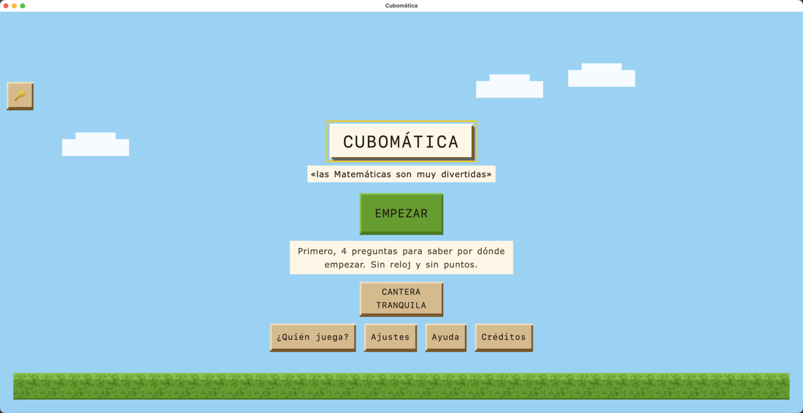

<div align="center">
  
  <h1>Cubomática</h1>
  <p><b>El juego de matemáticas de Educación Primaria,<br>como aplicación de escritorio para macOS.</b></p>
  <p>
    <a href="#versionado"></a>
    <a href=".python-version"></a>
    <a href="pyproject.toml"></a>
    <a href="https://docs.astral.sh/uv/"></a>
    <a href="#requisitos"></a>
    <a href="#tests"></a>
  </p>
  <br>
  
</div>

---

## Tabla de contenidos

- [Qué es esto](#qué-es-esto)
- [Requisitos](#requisitos)
- [Puesta en marcha](#puesta-en-marcha)
- [Uso diario](#uso-diario)
- [Tests](#tests)
- [Empaquetado](#empaquetado)
- [Estructura del proyecto](#estructura-del-proyecto)
- [Decisiones técnicas](#decisiones-técnicas)
- [El puente JavaScript ↔ Python](#el-puente-javascript--python)
- [Limitaciones conocidas](#limitaciones-conocidas)
- [Versionado](#versionado)

---

## Qué es esto

Una ventana nativa de macOS que carga el juego **Cubomática** (HTML, CSS y JavaScript sin
frameworks) mediante [pywebview](https://pywebview.flowrl.com/), empaquetada con PyInstaller
como `Cubomatica.app`. **La apariencia es idéntica a la del navegador.**

Ya no es una web ni una PWA. Se abre como cualquier aplicación del Mac, funciona sin conexión
y **no abre ningún puerto** en el equipo.

> [!IMPORTANT]
> La carpeta `src/cubomatica/web/` es **salida generada**: es una copia del `dist/` del proyecto
> del juego. Los cambios en el juego se hacen allí y se vuelven a copiar. Aquí solo vive la
> cáscara de escritorio (`main.py` y `api.py`).

---

## Requisitos

| | |
|---|---|
| **Sistema** | macOS 11 o superior |
| **Motor web** | WebKit — ya viene con el sistema, no hay que instalar nada |
| **Python** | 3.11, que instala `uv` automáticamente |
| **uv** | 0.12.0 o superior |

<details>
<summary>Otros sistemas operativos</summary>

El código es portable, pero el empaquetado de este repositorio es solo de macOS.

| Sistema | Motor web | Hay que instalar |
|---|---|---|
| Windows | WebView2 (Edge) | Normalmente ya viene en Windows 10 y 11 |
| Linux | GTK + WebKit2 | `sudo apt install python3-gi gir1.2-webkit2-4.1` |

</details>

---

## Puesta en marcha

**1. Instalar `uv`** (una sola vez):

```bash
curl -LsSf https://astral.sh/uv/install.sh | sh
uv --version          # debe ser 0.12.0 o superior
```

Si tu versión es más antigua, `uv` avisa y no continúa. Actualiza con `uv self update`.

**2. Instalar el proyecto**, desde su carpeta:

```bash
uv sync
```

Eso hace tres cosas: crea el entorno virtual en `.venv/`, instala las librerías declaradas en
`pyproject.toml` y genera `uv.lock` con las versiones exactas. **No hace falta activar el
entorno**: `uv` se encarga.

**3. Arrancar el juego:**

```bash
uv run cubomatica
```

---

## Uso diario

| Qué quiero | Comando |
|---|---|
| Arrancar la app | `uv run cubomatica` |
| Arrancar con DevTools y trazas | `CUBOMATICA_DEBUG=1 uv run cubomatica` |
| Pasar los tests | `uv run pytest` |
| Pasar un solo test | `uv run pytest tests/test_api.py -v` |
| Revisar el estilo | `uv run ruff check .` |
| Construir la app | `./build-mac.sh` |
| Regenerar el icono | `./make-icon.sh` |
| Añadir una librería | `uv add <librería>` |
| Añadir una de desarrollo | `uv add --dev <librería>` |
| Ver las instaladas | `uv pip list` |
| Instalar exactamente lo del lock | `uv sync --frozen` |

---

## Tests

```bash
uv run pytest                                              # los 36
uv run pytest --cov=cubomatica --cov-report=term-missing   # con cobertura
```

No comprueban solo la lógica de Python: casi todos protegen alguna decisión que, si se
revierte, rompe la app **en silencio**.

| Comprobación | Qué evita |
|---|---|
| La lógica de `api.py` | Regresiones en el puente |
| Los métodos `_privados` no se exponen a JavaScript | Filtrar API interna al navegador |
| Existen `index.html`, CSS, JS, imágenes y audio | Empaquetar una app incompleta |
| Todas las rutas del HTML son relativas | Que el `.app` abra una ventana en blanco |
| `main.py` carga con `file://` | El `404 Not Found` por choque de puertos |
| `main.py` usa `private_mode=False` | Perder los perfiles y el progreso al cerrar |
| `pyproject.toml` y el `.spec` declaran la misma versión | Que la app diga una versión y el paquete otra |
| Todas las librerías están fijadas con `==` | Que una actualización silenciosa rompa la app |

---

## Empaquetado

```bash
./build-mac.sh        # -> dist/Cubomatica.app
```

El script limpia, sincroniza dependencias, compila con PyInstaller y **firma la app en local**.
Esa firma *ad hoc* no es opcional en Apple Silicon: sin ella macOS cierra la app al abrirla.

El resultado pesa unos 68 MB, de los cuales unos 42 MB son las nueve pistas de música.

📄 El paso a paso completo, el icono y los problemas típicos están en **[EMPAQUETAR-MAC.md](EMPAQUETAR-MAC.md)**.

---

## Estructura del proyecto

```
cubomatica/
├── pyproject.toml           # librerías, versión y comando de arranque
├── uv.lock                  # versiones exactas (lo genera uv)
├── .python-version          # Python fijado en 3.11
├── Cubomatica.spec          # configuración del .app
├── build-mac.sh             # construye dist/Cubomatica.app
├── make-icon.sh             # regenera assets/icon.icns desde el SVG
├── assets/
│   ├── icon.svg             # el dibujo del icono (el mismo que el favicon)
│   └── icon.icns            # icono del .app
├── docs/                    # imágenes de este README
├── tests/
│   ├── conftest.py          # fixtures compartidas
│   ├── test_api.py          # lógica de Python
│   └── test_web.py          # ficheros, rutas, persistencia y versión
└── src/
    └── cubomatica/
        ├── main.py          # abre la ventana y monta el menú
        ├── api.py           # puente JavaScript ↔ Python
        └── web/             # EL JUEGO (generado, no editar aquí)
            ├── index.html
            ├── css/  js/  img/
            └── audio/       # música, ~42 MB
```

---

## Decisiones técnicas

Cuatro decisiones sostienen la app. Ninguna es cosmética: revertir cualquiera de ellas la
rompe, y en tres casos **sin dar ningún error**.

### La ventana arranca maximizada

El juego está pensado para apaisado y a pantalla completa, así que nadie tiene que colocar nada
antes de jugar. `width` y `height` (1280 × 800) no son el tamaño de arranque, sino el que tendrá
la ventana si se restaura. El mínimo es 1024 × 640.

### El juego se carga con `file://`

`main.py` abre la ventana con `url=index.as_uri()`.

Si se le pasa la ruta suelta, pywebview la considera «local» y **levanta un servidor HTTP
interno**. Con `private_mode=False` ese servidor usa siempre el **puerto fijo 42001**, así que
basta con que quede otra instancia viva para que la siguiente no pueda abrirlo y la ventana
muestre `Error: 404 Not Found` en lugar del juego.

Con `file://` no hay servidor, no hay puerto y no queda ningún socket a la escucha. La ruta se
resuelve además con `.resolve()`: dentro del `.app` la web cuelga de un enlace simbólico
(`Contents/Frameworks` → `Contents/Resources`) y WKWebView lo carga como una ventana en blanco
si no se resuelve.

### El progreso persiste gracias a `private_mode=False`

El juego guarda perfiles, progreso y ajustes en `localStorage`. Lo único que hace que sobrevivan
al cierre es arrancar con `private_mode=False`: en modo privado, el backend Cocoa usa un almacén
no persistente y se pierde todo.

> [!WARNING]
> **`storage_path` no tiene efecto en macOS.** pywebview lo ignora y usa siempre
> `WKWebsiteDataStore.defaultDataStore()`, es decir `~/Library/WebKit/<identificador>/WebsiteData/`.
> Se mantiene en el código porque Windows y Linux sí lo respetan.

Como consecuencia, el `.app` (`es.javiertamarit.cubomatica`) y el modo desarrollo
(`org.python.python`) **no comparten progreso**. Es lo deseable: probar no ensucia la partida real.

### El menú «Juego» está construido a mano


En la barra de macOS, junto a `Cubomatica` y `View`, hay un menú **Juego** que lleva a cuatro
pantallas sin pasar por la portada. Cada entrada ejecuta `CB.pantallas.ir('<pantalla>')`, el
mismo router que usan los botones del juego; para añadir o quitar entradas basta con tocar la
lista `MENU_PANTALLAS` de `main.py`.

| Elemento | Pantalla |
|---|---|
| ¿Quién juega? | `p-perfiles` |
| Ajustes | `p-ajustes` |
| Ayuda | `p-ayuda` |
| Créditos | `p-creditos` |

<details>
<summary><b>Por qué no se usa el parámetro <code>menu=</code> de pywebview</b></summary>

En pywebview 5.3.2 ese camino **no funciona en macOS**, por dos motivos independientes y ambos
silenciosos:

1. `start()` monta el menú **antes** de crear la ventana, y al crearla pywebview ejecuta
   `_clear_main_menu()` y lo borra. El menú ni siquiera llega a aparecer.
2. Aunque aparezca, los objetos internos que reciben el clic se pierden por recolección de
   basura, porque Cocoa **no retiene** el `target` de un `NSMenuItem`. El menú se despliega, se
   deja pulsar y no ocurre nada.

Por eso `instalar_menu()` lo construye con PyObjC después del evento `loaded` —ya pasado el
borrado— y guarda las referencias en `_REFERENCIAS_MENU`.

Cuidado además con el hilo: `evaluate_js` espera al hilo de la interfaz, así que llamarlo desde
la acción de un menú sin sacarlo a otro hilo **congela la aplicación**.

</details>

---

## El puente JavaScript ↔ Python

El juego es autocontenido y hoy no lo usa, pero está listo para cuando haga falta disco, red o
sistema.

**En Python** (`api.py`), cada método público queda expuesto:

```python
class Api:
    def saludar(self, nombre: str) -> str:
        return f"Hola, {nombre}"
```

**En JavaScript**, se llama así:

```javascript
const texto = await window.pywebview.api.saludar("Javi");
```

Los métodos que empiezan por `_` no se exponen, y hay un test que lo protege.

> [!TIP]
> Espera siempre al evento `pywebviewready` antes de usar la API: `window.pywebview.api` no
> existe todavía cuando la página termina de cargar.

---

## Limitaciones conocidas

| Limitación | Detalle |
|---|---|
| **Imprimir el informe** | WKWebView no implementa `window.print()`, así que el botón «Imprimir» del informe no hace nada dentro de la app. Se podría resolver exponiendo la impresión desde `api.py`. |
| **Service worker** | El juego lo registra si el navegador lo soporta; bajo `file://` no se activa. Es inofensivo: la app ya funciona sin conexión. |

---

## Versionado

| | |
|---|---|
| **Versión de la app** | **4.0.0**, declarada en `pyproject.toml` y `Cubomatica.spec` |
| **Versión del juego** | `CB.VERSION`, dentro del bundle web (hoy 3.4.7) |
| **Identificador** | `es.javiertamarit.cubomatica` |

Son dos números distintos a propósito: esta app empaqueta el juego, pero el juego se versiona en
su propio proyecto. Un test comprueba que las dos declaraciones de la versión de la app no se
desincronicen.

### Qué queda bajo control

| Qué | Dónde | Valor |
|---|---|---|
| Librerías | `pyproject.toml` | `pywebview==5.3.2` |
| Versiones exactas de todo | `uv.lock` | lo genera `uv` |
| Versión de Python | `.python-version` | `3.11` |
| Versión de la herramienta `uv` | `pyproject.toml` → `[tool.uv]` | `>=0.12.0` |

Los cuatro archivos deben subirse a git, **`uv.lock` incluido**.

<div align="center">
<sub>© 2026 Javier Tamarit</sub>
</div>
